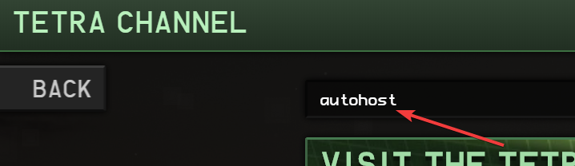
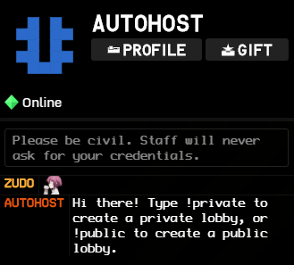

## ⚠⚠⚠ BIG SCARY DISCLAIMER ⚠⚠⚠

The source code is here to allow you to contribute to development and (perhaps) to learn. It's **NOT** for making
unauthorised bots. Ask osk for permission before connecting to TETR.IO with anything other than the official client.

99.9% of players **don't** need to try running the code themselves.

**You will be banned from the game if you don't follow the rules. It's not my fault if that happens.**

# Autohost for TETR.IO

A bot for osk's TETR.IO that allows for the following additional features in custom games:

* Automatic game starts
* Participation requirements:
    * Minimum / maximum rank
    * Minimum level
* Room bans
* Custom game presets

This is built on a custom Ribbon implementation in Node.js.

## How to use

Search for the user `AUTOHOST` in the ingame Tetra Channel.

Then, add the bot as a friend.

Click the newly appeared **Message** button, then send any message to the bot - you will receive a reply immediately.

## Commands

### Everyone

|Command|Arguments|Description|
|---|---|---|
|!help| |Shows the help message.|
|!host| |Shows who the current host is.|
|!queue| |In 1v1 mode, joins the queue.|
|!rules| |Shows the current participation rules.|
|!sip| |:serikasip:|

### Room moderator only

|Command|Arguments|Description|
|---|---|---|
|!autostart|`<time in seconds>`|Set the autostart timer, to automatically start the game when enough players are ready.|
|!ban|`<username>`|Bans a player from the lobby for the remainder of the session.|
|!cancelstart| |Cancels a pending autostart.|
|!hostmode| |Toggles host mode. This temporarily gives you control over the room to change any settings you want.|
|!kick|`<username>`|Kicks a player from the lobby.|
|!opponent|`<username>`|Enable 1v1 mode, and sets `<username>` as the opponent.|
|!preset|`<preset name>`|Sets a preset for the game. Type `!preset` without any arguments to see a list.|
|!queueoff| |Disables 1v1 mode.|
|!set|`<settings>`|Change lobby settings. Uses the same syntax as the built-in `/set` command, but can be used by all lobby moderators.|
|!sethost|`<username>`|Transfer host privileges to another player.|
|!setrule|`<rule> <value>`|Sets a participation rule. Type `!setrule` without any arguments to see a list.|
|!start| |Starts the game.|
|!unban|`<username>`|Unbans a previously banned player.|
|!unset|`<rule>`|Unsets a participation rule.|

### Room host only

|Command|Arguments|Description|
|---|---|---|
|!hostmode| |Toggles host mode. This temporarily gives you control over the room to change any settings you want.|
|!mod|`<username>`|Make another player a room moderator.|
|!name|`<room name>`|Change the name of the room.|
|!sethost|`<username>`|Transfer host privileges to another player.|
|!shutdown| |Closes the lobby.|
|!unmod|`<username>`|Remove room moderator from another player.|

### Developer only

|Command|Arguments|Description|
|---|---|---|
|!persist| |Toggle persist mode for a lobby.|

## Found a bug?

Please open an [issue](https://github.com/ZudoB/autohost/issues/new) or submit a pull request. Alternatively, send me a
message on Discord (`Zudo#0800`)

## Want to support the project?

**Please consider [supporting TETR.IO](https://tetr.io/#S:) instead** - osk deserves your money more than I do. However, I
do have a [Ko-fi](https://ko-fi.com/zudobtw) if you would like to help with hosting costs. 